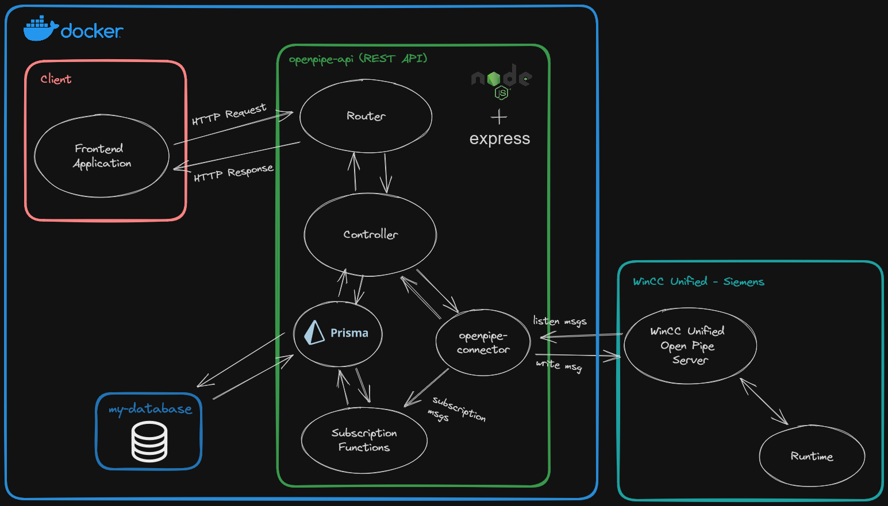
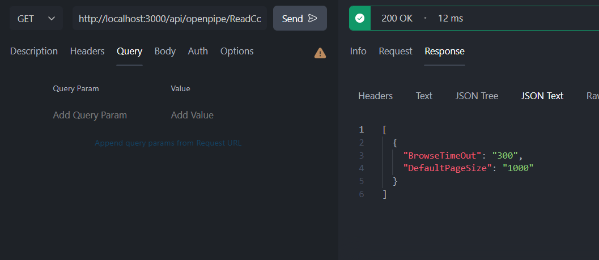
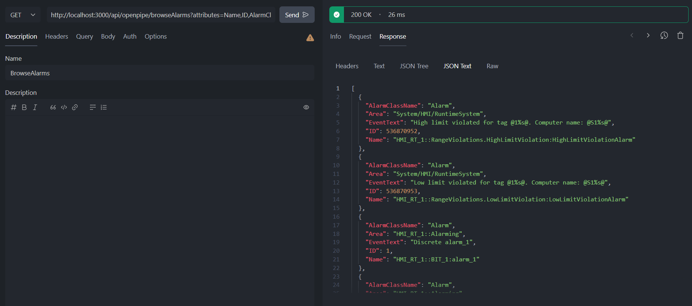
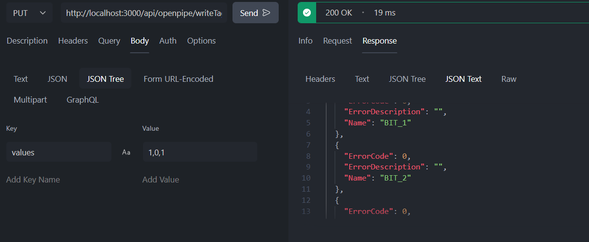
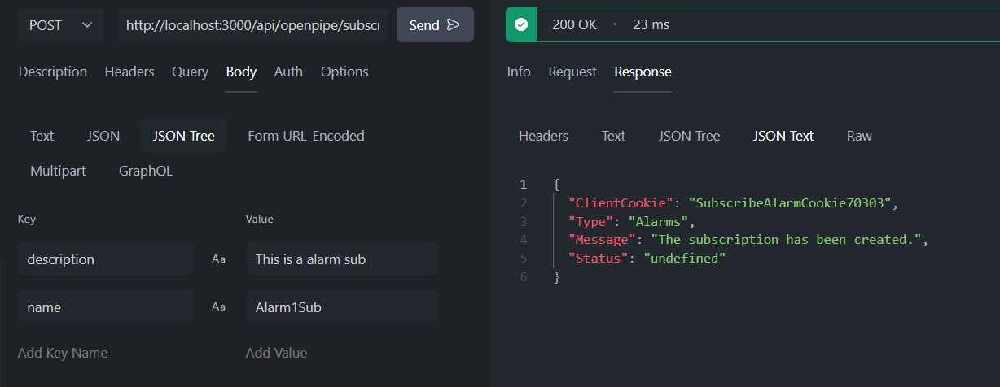
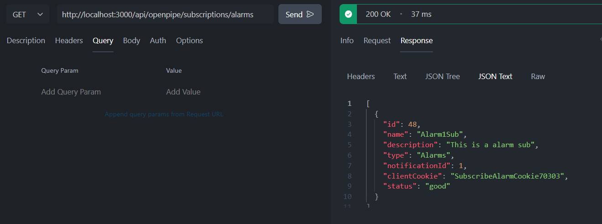
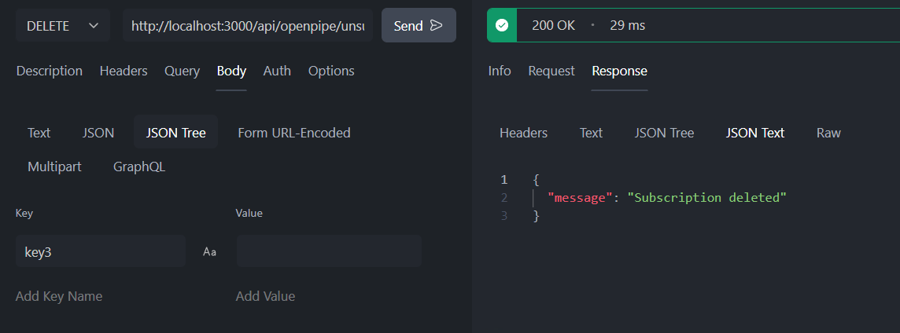

# Openpipe API REST

## ⚡ Resume
This is a basic implementation of an API REST that enables communication with Siemens WinCC Unified Open Pipe. Its goal is to create an abstraction layer to simplify frontend interaction with WinCC Unified Systems by making it easy to send and receive requests and responses via HTTP.

Note: Siemens provides alternative communication options for WinCC Unified, including the Open Development Kit (ODK) for custom application development and expanding functionalities, and GraphQL for efficient data querying and manipulation. These alternatives offer flexibility and customization possibilities to suit individual project needs.

## 💻 Used technologies
- Node.js
- Express.js
- Prisma
- Docker
- MySQL
- WinCC Unified Open Pipe (Siemens)

## 📖 Schema

## 📫 API Endpoints 

The following endpoints are available:

| Method | Endpoint                                   | Description                                      |
|--------|--------------------------------------------|--------------------------------------------------|
| POST   | /api/openpipe/subscribeTags                | Subscribe to tags                                |
| POST   | /api/openpipe/subscribeAlarms              | Subscribe to alarms                              |
| GET    | /api/openpipe/browseAlarms                 | Browse configured alarms                         |
| GET    | /api/openpipe/browseAlarmClasses           | Browse configured alarm classes                  |
| GET    | /api/openpipe/browseTags                   | Browse configured tags                           |
| GET    | /api/openpipe/readTags                     | Read tags                                        |
| GET    | /api/openpipe/readAlarms                   | Read alarms                                      |
| GET    | /api/openpipe/readConfig                   | Read configuration                               |
| GET    | /api/openpipe/subscriptions                | Get subscriptions                                |
| GET    | /api/openpipe/subscriptions/:type          | Get subscriptions by type                        |
| GET    | /api/openpipe/subscription/:cookie         | Get subscription by cookie                       |
| PUT    | /api/openpipe/connect                      | Connect                                          |
| PUT    | /api/openpipe/disconnect                   | Disconnect                                       |
| PUT    | /api/openpipe/writeConfig                  | Write configuration                              |
| PUT    | /api/openpipe/writeTags                    | Write tags                                       |
| DELETE | /api/openpipe/unsubscribe/tags/:cookie     | Unsubscribe from tags                            |
| DELETE | /api/openpipe/unsubscribe/alarms/:cookie   | Unsubscribe from alarms                          |

## Screenshots

## Siemens WinCC Unified Open Pipe Documentation
For more detailed information about the messages and functionalities supported by Siemens Open Pipe, refer to the official Siemens OpenPipe documentation: 
https://support.industry.siemens.com/cs/document/109778823/simatic-hmi-wincc-unified-open-pipe

Please note that this API is a specific abstraction layer built for communication with the Siemens Open Pipe Server. It is not an official Siemens product and is unrelated to the company.

## Industrial Edge Compatibility
Initially, this REST API application is designed to be used in an Industrial Edge environment and can be installed on a Unified Comfort Panel or a PC with Unified PC Runtime using docker.
